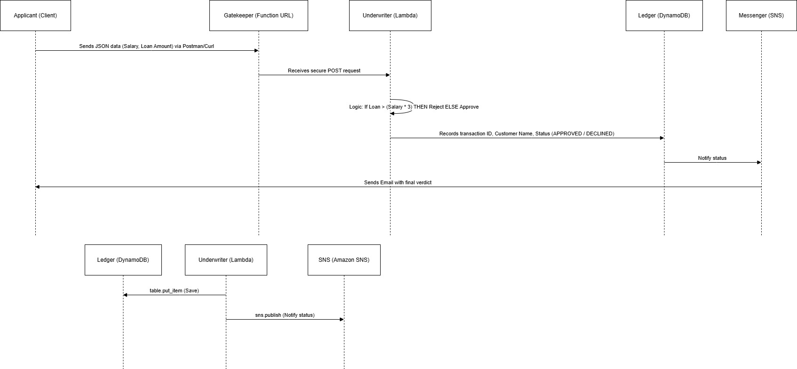
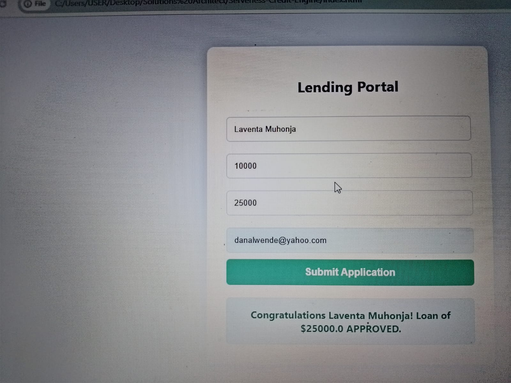
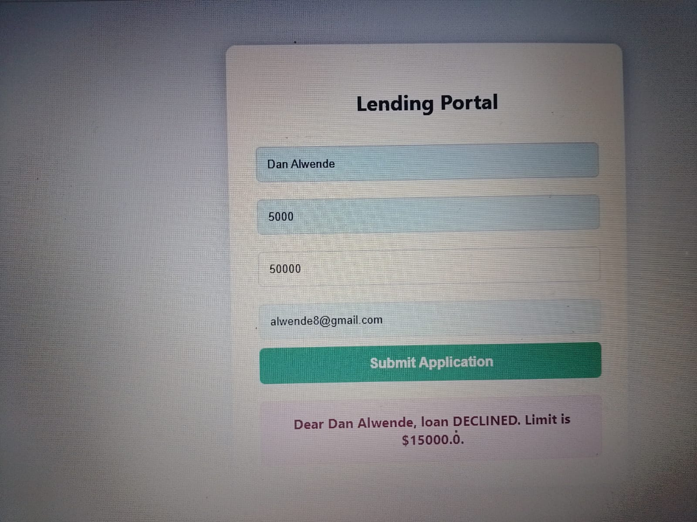

# Serverless Credit Decision Engine 🏦

### **Project Status: PRODUCTION-READY 🟢**

**Author:** Dan Alwende
**Architecture:** Event-Driven Serverless
**Tech Stack:** AWS (S3, Lambda, DynamoDB, SNS), Python, JavaScript, GitHub Actions

---

## 📖 Project Overview

This project is a fully automated lending infrastructure designed to eliminate manual credit underwriting. It captures applicant data via a web portal, evaluates financial risk using a serverless decision engine, and persists the audit trail in a NoSQL database—all in under 400ms.



### **Core Business Logic**

* **Risk Evaluation:** Automated Debt-to-Income (DTI) assessment.
* **Decision Parameters:** Applications are `APPROVED` if the loan amount is ≤ 3x Monthly Salary; otherwise, they are `DECLINED`.
* **Real-time Notifications:** Automated email dispatch via SNS based on the engine's decision.

---

## 🏗️ Technical Architecture

### **1. Presentation Layer (Amazon S3)**

* **Component:** Static Website Hosting.
* **Implementation:** Responsive HTML5/CSS3/JS portal.
* **Function:** Captures user input and executes asynchronous `POST` requests to the Backend API.

### **2. Logic Layer (AWS Lambda)**

* **Component:** Python Decision Engine.
* **Handling:** Configured with a custom handler (`credit_engine.lambda_handler`) to process JSON payloads.
* **Security:** CORS (Cross-Origin Resource Sharing) enabled to allow secure communication with the S3-hosted frontend.

### **3. Data Layer (Amazon DynamoDB)**

* **Component:** NoSQL Database.
* **Table:** `LoanApplications`.
* **Function:** Stores immutable records of every transaction, including `ApplicationID`, `Status`, and `Timestamp` for compliance and auditing.

### **4. Notification Layer (Amazon SNS)**

* **Component:** Simple Notification Service.
* **Topic:** `Loan-Notification-Service`.
* **Trigger:** Decoupled alert system that sends decision emails to applicants.

---

## 🚀 Deployment & Configuration

### **Prerequisites**

* AWS Account with IAM permissions for Lambda, S3, DynamoDB, and SNS.
* GitHub repository for CI/CD integration.

### **Environment Variables**

The Lambda function requires the following environment variables:

* `SNS_TOPIC_ARN`: The ARN of your SNS Topic.
* `DYNAMODB_TABLE`: `LoanApplications`.

### **CORS Configuration**

To enable web access, the Lambda Function URL must be configured with:

* **Allowed Origins:** `*` (or your specific S3 bucket URL).
* **Allowed Methods:** `POST`.
* **Allowed Headers:** `content-type`.

---

## 🧪 Testing the Engine

You can test the engine via the **Web Portal** or via **cURL**:

```bash
curl -X POST [https://your-lambda-url.aws/](https://your-lambda-url.aws/) \
  -H "Content-Type: application/json" \
  -d '{"name": "Dan Alwende", "monthly_salary": 5000, "loan_amount": 10000, "email": "alwende8@gmail.com"}'

---

## 📊 Execution Proof

Below is the validation of the system's decision-making logic:

<p align="center">
  
  
</p>

📉 Performance Metrics
Latency: <400ms end-to-end decisioning.

Cost: $0.00 (Operates entirely within the AWS Free Tier).

Scalability: Inherently scales to thousands of concurrent applications without server management.
